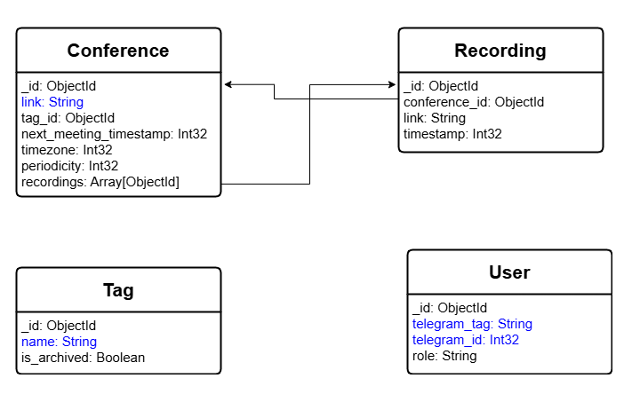

# ConfereeTgBot

## Table of Contents
[TOC]

## Overview
This project is a Telegram bot for managing and recording Google Meet conferences through the [GMeetBot service](https://github.com/ConfereeBot/GMeetBot).
The bot allows users to plan, tag, and search conference recordings, manage access roles, and schedule regular recordings.

## Features
- **Conference Management**: Schedule recordings of Google Meet conferences.
- **Tagging**: Manage tags to recordings for easy search and categorization.
- **Search**: Search recordings by tags or conference links.
- **Role Management**: Manage user roles and access to bot functionalities.
- **Regular Recordings**: Schedule recurring conference recordings.

## Demonstration
...

## Roles and Permissions

| Role   | Manage Admins | Create Tags | Schedule Recordings | View Recordings | Search by Tags/Links |
|--------|----------------|-------------|---------------------|------------------|----------------------|
| **Owner** | Yes            | Yes         | Yes                 | Yes              | Yes                  |
| **Admin** | No             | Yes         | Yes                 | Yes              | Yes                  |
| **User**  | No             | No          | No                  | Yes              | Yes                  |

## Architecture

The bot uses the following components:
- **MongoDB**: Stores metadata about recordings and user information.
- **RabbitMQ**: Communicates with the [GMeetBot microservice](https://github.com/ConfereeBot/GMeetBot) for handling conference recordings.

### MongoDB schema

## Debug project
1. Clone `git clone https://github.com/ConfereeBot/ConfereeTgBot.git`
2. Install dependences `poetry install`
3. Install git-hooks `pre-commit install`
4. Configure `.env`
5. Run project `docker compose up --build`

## Deploy project
1. Clone `git clone https://github.com/ConfereeBot/ConfereeTgBot.git`
2. Configure `.env`
3. Run project `docker compose up --build`
