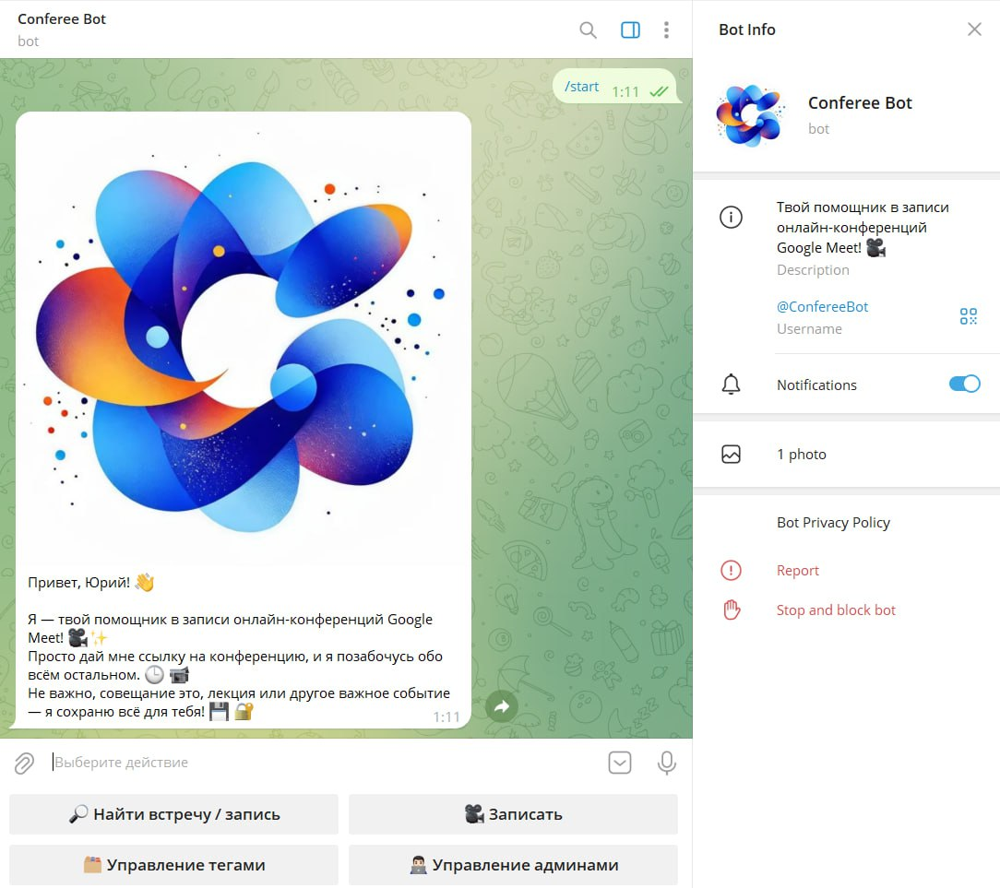
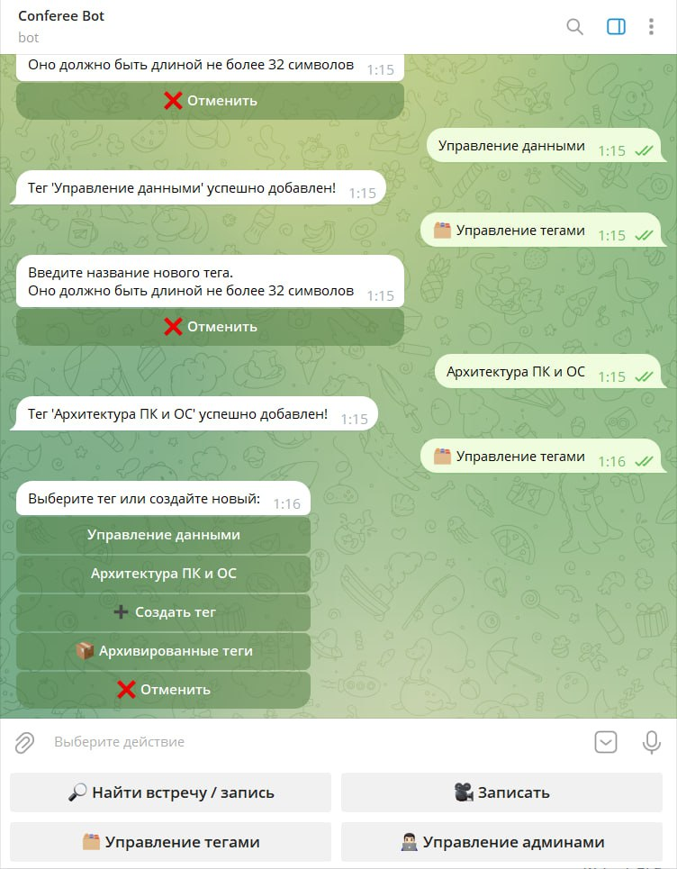
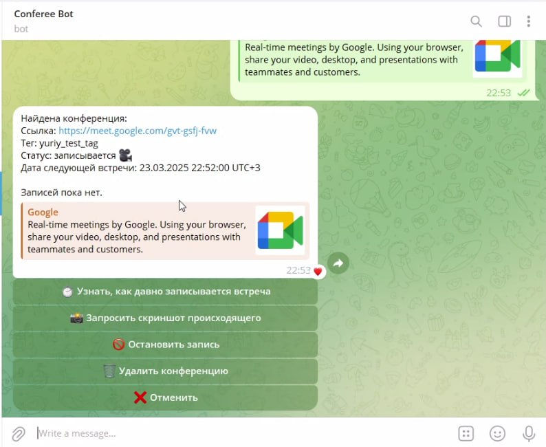
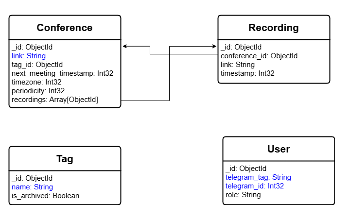

# 🤖ConfereeTgBot

## Table of Contents
- [🤖ConfereeTgBot](#confereetgbot)
  - [Table of Contents](#table-of-contents)
  - [🌐Overview](#overview)
    - [⚙️Features](#️features)
  - [🎥Demonstration](#demonstration)
  - [🛠️Roles and Permissions](#️roles-and-permissions)
  - [🏗️Architecture](#️architecture)
    - [📊MongoDB schema](#mongodb-schema)
  - [🐞Debug project](#debug-project)
  - [🚀Deploy project](#deploy-project)

## 🌐Overview
This project is a Telegram bot for managing and recording Google Meet conferences through the [GMeetBot service](https://github.com/ConfereeBot/GMeetBot).
The bot allows users to plan, tag, and search conference recordings, manage access roles, and schedule regular recordings.

### ⚙️Features
- **Conference Management**: Schedule recordings of Google Meet conferences.
- **Tagging**: Manage tags to recordings for easy search and categorization.
- **Search**: Search recordings by tags or conference links.
- **Role Management**: Manage user roles and access to bot functionalities.
- **Regular Recordings**: Schedule recurring conference recordings.

## 🎥Demonstration

## 🛠️Roles and Permissions

| Role   | Manage Admins🧑‍💼 | Create Tags🏷️ | Schedule Recordings📅 | View Recordings👀 | Search by Tags/Links🔍 |
|--------|----------------|-------------|---------------------|------------------|----------------------|
| **Owner** | ✅            | ✅         | ✅                 | ✅              | ✅                  |
| **Admin** | ❌             | ✅         | ✅                 | ✅              | ✅                  |
| **User**  | ❌             | ❌          | ❌                  | ✅              | ✅                  |

## 🏗️Architecture

The bot uses the following components:
- **MongoDB**: Stores metadata about recordings and user information.
- **RabbitMQ**: Communicates with the [GMeetBot microservice](https://github.com/ConfereeBot/GMeetBot) for handling conference recordings.

### 📊MongoDB schema

## 🐞Debug project
1. Clone `git clone https://github.com/ConfereeBot/ConfereeTgBot.git`
2. Install dependences `poetry install`
3. Install git-hooks `pre-commit install`
4. Configure `.env`
5. Run project `docker compose up --build`

## 🚀Deploy project
1. Clone `git clone https://github.com/ConfereeBot/ConfereeTgBot.git`
2. Configure `.env`
3. Run project `docker compose up --build`
